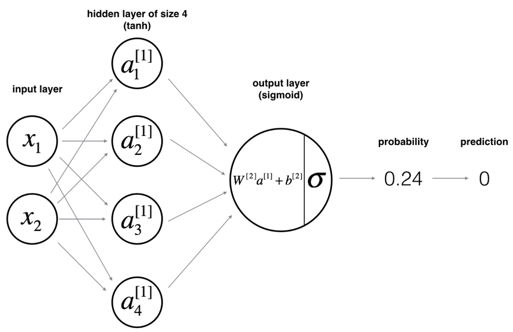
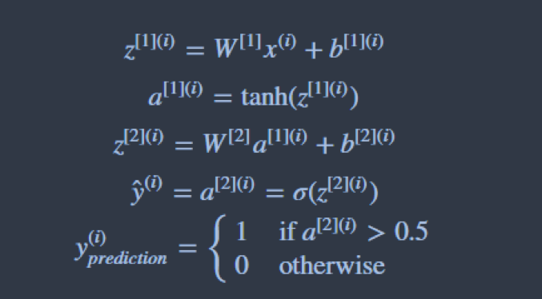
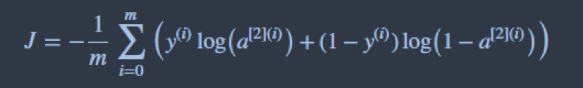
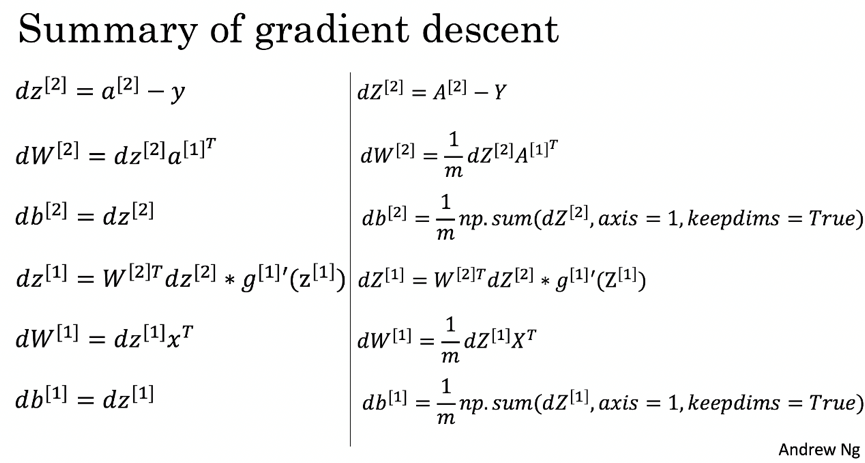
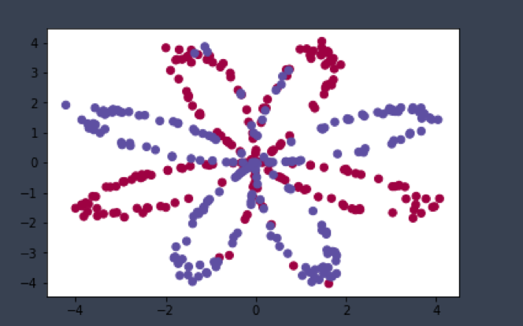
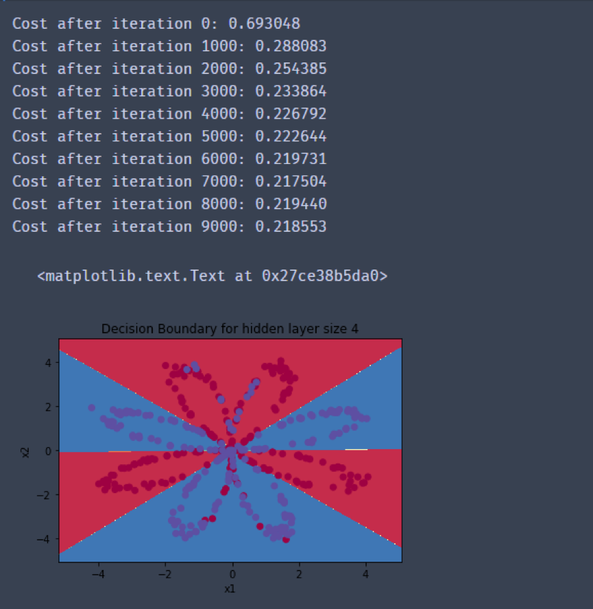

# 神经网络

## 实验目的

本次实验目的是让大家了解深度学习的基础，即神经网络的基本内容。

## 实验内容

本次实验要求动手实现一个两层的神经网络，并用该神经网络模型完成分类任务。神经网络模型的结构如下：



 

神经网络的计算和训练过程可以分为三个阶段：

--向前传播

--计算cost

--反向传播

 

前向传播的过程比较简单，我们只是通过特点的计算规则，根据前一层神经元和权值计算出结果，经过非线性映射后，传递到下一层，计算过程如下：



 

 

这个过程称为 前向传播的过程。

在最后一层，我们需要定义一个损失函数，如下图。我们通过该损失函数可以计算经过当前前向传播过程，我们的最终的损失是多少，并依此来指导我们更新整个神经网络的参数：

 

 

最后是反向传播过程，其实这个过程就是更新整个神经网络中每层参数的过程，反向传播过程是通过梯度下降算法来完成的。根据损失函数和链式求导规则，我们可以从后往前逐层计算每一层神经网络参数的梯度，从而完成一次神经网络参数的更新过程，这里我们直接给出本文中这个简单神经网络的每层的梯度更新式，具体推到过程没有给出，感兴趣可以自己试一下。



 ```python
import numpy as np

import matplotlib.pyplot as plt

from testCases import *

import sklearn

import sklearn.datasets

import sklearn.linear_model

from planar_utils import plot_decision_boundary, sigmoid, load_planar_dataset, load_extra_datasets
%matplotlib inline

X, Y = load_planar_dataset() 
 ```


我们使用sklearn数据集中的一个简单例子，数据图像如下 



 

下面这个函数用来定义整个神经网络的规模，即每一层神经元的数量

 ```python
def layer_sizes(X, Y):

​    """

​    Arguments:

​    X -- input dataset of shape (input size, number of examples)

​    Y -- labels of shape (output size, number of examples)

​    

​    Returns:

​    n_x -- the size of the input layer

​    n_h -- the size of the hidden layer

​    n_y -- the size of the output layer

​    """

​    n_x = X.shape[0] # size of input layer

​    n_h = 4

​    n_y = Y.shape[0] # size of output layer

​    return (n_x, n_h, n_y)
 ```


下面这个函数用于随机初始化每个层神经元的参数，随机初始化参数之后，我们的整个网络可以看作一个高维空间中的随便的一个决策边界。

 ```python
\# GRADED FUNCTION: initialize_parameters

def initialize_parameters(n_x, n_h, n_y):

​    """

​    Argument:

​    n_x -- size of the input layer

​    n_h -- size of the hidden layer

​    n_y -- size of the output layer

​    

​    Returns:

​    params -- python dictionary containing your parameters:

​                    W1 -- weight matrix of shape (n_h, n_x)

​                    b1 -- bias vector of shape (n_h, 1)

​                    W2 -- weight matrix of shape (n_y, n_h)

​                    b2 -- bias vector of shape (n_y, 1)

​    """

​    W1 = np.random.randn(n_h, n_x) * 0.01

​    b1 = np.zeros((n_h, 1))

​    W2 = np.random.randn(n_y, n_h) * 0.01

​    b2 = np.zeros((n_y, 1))

​    

​    parameters = {"W1": W1,

​                  "b1": b1,

​                  "W2": W2,

​                  "b2": b2}

​    return parameters 
 ```


下面这个函数定义了前向传播计算过程，通过numpy的矩阵计算工具进行计算。计算结果保存在cache中，因为反向传播计算梯度时需要使用这些参数。

 ```python
\# GRADED FUNCTION: forward_propagation

 

def forward_propagation(X, parameters):

​    """

​    Argument:

​    X -- input data of size (n_x, m)

​    parameters -- python dictionary containing your parameters (output of initialization function)

​    

​    Returns:

​    A2 -- The sigmoid output of the second activation

​    cache -- a dictionary containing "Z1", "A1", "Z2" and "A2"

​    """

​    \# Retrieve each parameter from the dictionary "parameters"

​    W1 = parameters["W1"]

​    b1 = parameters["b1"]

​    W2 = parameters["W2"]

​    b2 = parameters["b2"]

​    \# Implement Forward Propagation to calculate A2 (probabilities)

​    Z1 = np.dot(W1, X) + b1

​    A1 = np.tanh(Z1)

​    Z2 = np.dot(W2, A1) + b2

​    A2 = sigmoid(Z2)

​    cache = {"Z1": Z1,

​             "A1": A1,

​             "Z2": Z2,

​             "A2": A2}

​    return A2, cache
 ```

 

下面这个函数通过如下的损失函数公式完成损失的计算

损失函数如下：


 

 ```python
\# GRADED FUNCTION: compute_cost

 

def compute_cost(A2, Y, parameters):

​    """

​    Computes the cross-entropy cost given in equation (13)

​    

​    Arguments:

​    A2 -- The sigmoid output of the second activation, of shape (1, number of examples)

​    Y -- "true" labels vector of shape (1, number of examples)

​    parameters -- python dictionary containing your parameters W1, b1, W2 and b2

​    

​    Returns:

​    cost -- cross-entropy cost given equation (13)

​    """

​    

​    m = Y.shape[1] # number of example

 

​    \# Compute the cross-entropy cost

​    logprobs = np.multiply(np.log(A2), Y) + np.multiply(np.log(1-A2), (1-Y))

​    cost = -1/m*np.sum(logprobs)

​    

​    cost = np.squeeze(cost)     # makes sure cost is the dimension we expect. 

​    

​    return cost
 ```

更新参数的公式如下：

 

  

下面的函数计算了神经网络中每一层的梯度

```python
\# GRADED FUNCTION: backward_propagation

 

def backward_propagation(parameters, cache, X, Y):

​    """

​    Implement the backward propagation using the instructions above.

​    

​    Arguments:

​    parameters -- python dictionary containing our parameters 

​    cache -- a dictionary containing "Z1", "A1", "Z2" and "A2".

​    X -- input data of shape (2, number of examples)

​    Y -- "true" labels vector of shape (1, number of examples)

​    

​    Returns:

​    grads -- python dictionary containing your gradients with respect to different parameters

​    """

​    m = X.shape[1]

​    

​    \# First, retrieve W1 and W2 from the dictionary "parameters".

​    W1 = parameters["W1"]

​    W2 = parameters["W2"]

 

​        

​    \# Retrieve also A1 and A2 from dictionary "cache".

 

​    A1 = cache["A1"]

​    A2 = cache["A2"]

​    

​    \# Backward propagation: calculate dW1, db1, dW2, db2. 

 

​    dZ2 = A2 - Y    # (n_y,1)

​    dW2 = 1 / m * np.dot(dZ2, A1.T)   # (n_y, 1) .* (1, n_h)

​    db2 = 1 / m * np.sum(dZ2, axis=1, keepdims=True)

​    dZ1 = np.dot(W2.T, dZ2) *  (1 - np.power(A1, 2))

​    dW1 = 1 / m * np.dot(dZ1, X.T)

​    db1 = 1 / m * np.sum(dZ1, axis=1, keepdims=True)

​    

​    grads = {"dW1": dW1,

​             "db1": db1,

​             "dW2": dW2,

​             "db2": db2}

​    

​    return grads
```

根据梯度下降算法，我们将每一层神经网络中的参数减去它的梯度和学习率的乘积，完成参数更新。

```
\# GRADED FUNCTION: update_parameters

 

def update_parameters(parameters, grads, learning_rate = 1.2):

​    """

​    Updates parameters using the gradient descent update rule given above

​    

​    Arguments:

​    parameters -- python dictionary containing your parameters 

​    grads -- python dictionary containing your gradients 

​    

​    Returns:

​    parameters -- python dictionary containing your updated parameters 

​    """

​    \# Retrieve each parameter from the dictionary "parameters"

​    W1 = parameters["W1"]

​    b1 = parameters["b1"]

​    W2 = parameters["W2"]

​    b2 = parameters["b2"]

​    

​    \# Retrieve each gradient from the dictionary "grads"

​    dW1 = grads["dW1"]

​    db1 = grads["db1"]

​    dW2 = grads["dW2"]

​    db2 = grads["db2"]

​    

​    \# Update rule for each parameter

​    W1 -= learning_rate * dW1

​    b1 -= learning_rate * db1

​    W2 -= learning_rate * dW2

​    b2 -= learning_rate * db2

​    

​    parameters = {"W1": W1,

​                  "b1": b1,

​                  "W2": W2,

​                  "b2": b2}

​    return parameters
```


以上我们完成了神经网络构建和训练的相关工具函数，通过上面的这些函数，你应该对神经网络的计算过程有了一个比较清晰的认识。下面我们使用这些工具函数完成一个神经网络的训练过程，

训练需要经过多次迭代才能收敛，每次迭代包括前向传播、计算损失和后向传播三个过程。训练结束后，我们得到神经网络中的最优参数。

```python
\# GRADED FUNCTION: nn_model

 

def nn_model(X, Y, n_h, num_iterations = 10000, print_cost=False):

​    """

​    Arguments:

​    X -- dataset of shape (2, number of examples)

​    Y -- labels of shape (1, number of examples)

​    n_h -- size of the hidden layer

​    num_iterations -- Number of iterations in gradient descent loop

​    print_cost -- if True, print the cost every 1000 iterations

​    

​    Returns:

​    parameters -- parameters learnt by the model. They can then be used to predict.

​    """

​    n_x = layer_sizes(X, Y)[0]

​    n_y = layer_sizes(X, Y)[2]

​    

​    \# Initialize parameters, then retrieve W1, b1, W2, b2. Inputs: "n_x, n_h, n_y". Outputs = "W1, b1, W2, b2, parameters".

​    parameters = initialize_parameters(n_x, n_h, n_y)

​    W1 = parameters["W1"]

​    b1 = parameters["b1"]

​    W2 = parameters["W2"]

​    b2 = parameters["b2"]

​    

​    \# Loop (gradient descent)

 

​    for i in range(0, num_iterations):

​        A2, cache = forward_propagation(X, parameters)

​        cost = compute_cost(A2, Y, parameters)

​        grads = backward_propagation(parameters, cache, X, Y)

​        parameters = update_parameters(parameters, grads, learning_rate = 1.2)

​        if print_cost and i % 1000 == 0:

​            print ("Cost after iteration %i: %f" %(i, cost))

​    return parameters
```

通过训练得到的参数，只要进行前向传播计算，我们就可以完成预测。

 

```python


\# GRADED FUNCTION: predict

 

def predict(parameters, X):

​    """

​    Using the learned parameters, predicts a class for each example in X

​    

​    Arguments:

​    parameters -- python dictionary containing your parameters 

​    X -- input data of size (n_x, m)

​    

​    Returns

​    predictions -- vector of predictions of our model (red: 0 / blue: 1)

​    """

​    

​    \# Computes probabilities using forward propagation, and classifies to 0/1 using 0.5 as the threshold.

​    A2, cache = forward_propagation(X, parameters)

​    predictions = (A2 > 0.5)

​    return predictions


\# Build a model with a n_h-dimensional hidden layer

parameters = nn_model(X, Y, n_h = 4, num_iterations = 10000, print_cost=True)

 

\# Plot the decision boundary

plot_decision_boundary(lambda x: predict(parameters, x.T), X, Y)

plt.title("Decision Boundary for hidden layer size " + str(4))

 

 

predictions = predict(parameters, X)

print ('Accuracy: %d' % float((np.dot(Y,predictions.T) + np.dot(1-Y,1-predictions.T))/float(Y.size)*100) + '%') 
```

结果如图：




 

 

 

 

 