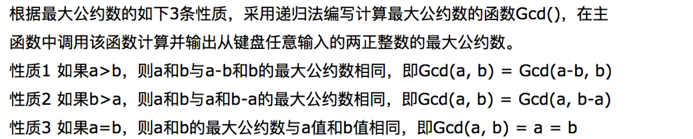
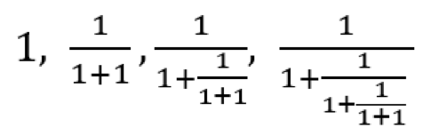

# 实验三

## 实验目的

通过Python实践数据的表示与处理的基本操作 

## 实验内容

数据的进制转换以及数据类型表示

##实验步骤和结果

### 实验一 10进制小数转2进制

编写Python程序，完成十-二 进制小数转换。输入是一个十进制的小数，输出转换后小数部分的二进制表示
#### [参考代码]

```
def dec2bin(x):
    x -= int(x)
    bins = []
    while x:
        x *= 2
        bins.append(1 if x>=1. else 0)
        x -= int(x)
    return bins
​
​
x = float(input())

bins = dec2bin(x)
print (bins)
```

#### [实验结果]

```
0.8

[1, 1, 0, 0, 1, 1, 0, 0, 1, 1, 0, 0, 1, 1, 0, 0, 1, 1, 0, 0, 1, 1, 0, 0, 1, 1, 0, 0, 1, 1, 0, 0, 1, 1, 0, 0, 1, 1, 0, 0, 1, 1, 0, 0, 1, 1, 0, 0, 1, 1, 0, 1]
```

### 实验二 任意进制转10进制

请写Python程序完成b-十的实数转换。
#### [参考代码]

```
def b2dec_int(x,b):
    d =0
    weight = b**(len(x)-1)
    for i in range(len(x)):
        if x[i] !='0':
            d = d+ weight*int(x[i])
        weight = weight // b
    #print (d)
    return d
​
​
def b2dec_float(y,b):
    d = 0
    for i in range(len(y)):
        if y[i]!='0':
            d += int(y[i])*(b**(-(i+1)))
    #print (d)
    return d
​
​
def b2dec_float2(y,b):
    d =0
    weight = b**(-len(y))
    for i in range(len(y)-1,-1,-1):
        if y[i]!='0':
            d = d+ weight*int(y[i])
        weight = weight*b
    return d
​
​
def b2dec(s,b):
    x,y = s.split('.')
    #print (x,y)
    x_=b2dec_int(x,b)
    y_=b2dec_float(y,b)
    print (x_+y_)
​
x = input()
43211.01234567
b = int(input())

b2dec(x,b)
```

#### [结果]

```
110.11
2
6.75
```
思考：可以参考b2dec_int函数的思路，改写b2dec_float函数么？

### 实验三 10进制转2进制（包含小数部分）

完成十进制到二进制的包含小数的转换。输入时一个带小数点的十进制数，输出是带小数点的二进制数。

```
def dec2bin_int(x):
    if x <2 :
        return [x]
    r = x%2
    return (dec2bin_int(x//2) + [r])
​
def dec2bin_float(x):
    x -= int(x)
    bins = []
    while x:
        x *= 2
        bins.append(1 if x>=1. else 0)
        x -= int(x)
    return bins
    
def dec2bin(num):
    x = int (num)
    y = num - int(num)
    #print (x,y)
    x_=dec2bin_int(x)
    y_=dec2bin_float(y)
    s = ''
    for i in x_:
        s=s+str(i)
    s+='.'
    for i in y_:
        s+=str(i)
    print (s)
​
​
x = float(input())
dec2bin(x)

```

#### [结果]

```
10.75
1010.11
```

### 实验四 用逻辑做加法

[实验内容]
设计一个全加器，全加器有三个输入：A和B是两个加数，Ci是从下一位获得的进位，和两个输出：Sum，给上一位的进位C。逻辑可以表示为

```
C = A & B | A & Ci | B & Ci，
Sum = A & B & Ci | A & !B & !Ci | !A & B & !Ci | !A & !B Ci。
```

```
def FA(a, b, c):
    Carry = (a and b) or (b and c) or (a and c)
    Sum = (a and b and c) or (a and (not b) and (not c)) or ((not a) and b and (not c)) or ((not a) and (not b) and c)
    return Carry,Sum 
    
def add(x, y):
    while len(x) < len(y) : x = [False] + x
    while len(y) < len(x) : y = [False] + y
    L = [];Carry = False
    for i in range(len(x)-1,-1,-1):
        Carry,Sum = FA(x[i],y[i],Carry)
        L = [Sum] + L
    return (Carry, L)
​
print (add([True,True],[True,True,True]))
```
### [输出结果]

```
(True, [False, True, False])
```

那么，如何实现乘法？

```
def multiplier (x,y):
    S = []
    for i in range(len(y)-1, -1, -1):
        if y[i] == True:
            C,S = add(S,x)
            if C == True:
                S = [C] + S
        x = x + [False]
    return (S)
​
​
x = [True,True]
y = [True,False,True]
print (multiplier(x, y))
```

#### [输出结果]

```
[True, True, True, True]
```

### 实验五 数据类型表示

```
数值类型的表示
1、产生10-20的随机浮点数
import random 
f = random.uniform(10,20)
print(f)

2、产生10-20的随机整数
import random
i = random.randint(10,20)
print(i)

3、布尔型例子
b = 100<101
print(b)

4、字符串
print("book's price")

print('book's price')

SyntaxError: invalid syntax
python无法判别book后面的单引号是字符串的结尾，还是字符串的符号，需要转义字符‘\’进行转义
print('book\'s price')  

5、列表
l = [1,1.3,'2','China',['I','am','another','list']]  
l[0]

列表元素可以包括整数型、浮点型、字符串、还可以是列表
l[0]#取出第一个元素
l[-1]

取出最后一个元素
l[4][0]

取出列表里列表的元素
l[1:]

取出第2个到最后一个元素
l1 = [1,1.3]
l2 = ['2','China',['I','am','another','list']]
l = l1+l2
print(l)

列表加法
6、字典
d = {'Michael':95,'Bob':89,'Tracy':92}
d['Bob']

```

### 实验六 赋值语句

[实验内容]

```
1、序列赋值
a,b = 4,5
c,d = (6,7)
e,f = 'AB'
print(a,b,c,d,e,f)

2、扩展序列赋值
i,*j = range(4)  #在赋值操作中，左边的变量个数总是等于右边，如果不等就会报错，使用带星号实现扩展序列赋值
print(i,j)

3、增强赋值语句
l = [1,2]   
l1 = l
l += [3,4]
print(l,l1)

对L的改变会影响其他变量
l = [1,2]   
l1 = l
l = l+[3,4]
print(l,l1)

不使用增强赋值语句,对L的改变不会影响其他变量
```

### 实验七 控制结构

```
1、if语句实现百分制转等级制
def if_test(score):
    if(score>=90):
        print('Excellent')
    elif(score>=80):
        print('Very good')
    elif(score>=70):
        print('Good')
    elif(score>=60):
        print('Pass')
    else:
        print('Fail')
​
if_test(45)

2、while循环判断b是否为质数
b = int(input())
9
a = b//2
while a>1:
    if b%a ==0:
        print('b is not prime')
        break
    a = a-1
else :
    print('b is prime')
​
​

3、for语句循环遍历
l = ['python','is','a','good','language']
for i in range(len(l)):
    print(i,l[i],end=' ')
```

### 实验八 函数调用和参数传递


对于下面三个函数，你认为应该输出什么？

```
def func(L1):
    L1.append(1)
​
​
L=[2]
func(L)
print(L)

def func2(L1):
    x = L1 + [1]
    print (x,L1)
 
​
L = [2]
func2(L)
print (L)

def recursive(L):
    if L ==[]: return 
    L = L[0:len(L)-1]
    print ("L=",L)
    recursive(L)
    print ("L:",L)
    return 
​
​
recursive([1,2,3])
```

### 实验九 最大公约数


​
​

```
def GCD(x,y):
    if x>y:
        a = x; b=y
    else :
        a = y; b = x
    if a%b ==0:
        return (b)
    return (GCD(a%b,b))
​
​
x = int(input())
625
y = int(input())
75
print ('x和y的最大公约数为：',GCD(x,y))
​
​
```

### 实验十 排序

#### [实验内容]
完成merge（L1,L2）函数：输入参数是连个从小到大排好序的证书列表L1和L2，返回合成后的从小到大排好序的大列表X。例如merge（[1,4,5],[2,7]）会返回[1,2,4,5,7]，要求比较两列表元素大小的次数不能超过len(L1)+len(L2)。

```
def merge(L1,L2):
    i = 0
    j = 0
    L = []
    while (i<len(L1)) & (j<len(L2)):
        if L1[i]<L2[j]:
            L.append(L1[i])
            i+=1
            #print ("i",i)
        else :
            L.append(L2[j])
            j+=1
            #print ("j",j)
    if i==len(L1):
        for k in range(j,len(L2)):
            L.append(L2[k])
    if j==len(L2) :
        for k in range(i,len(L1)):
            L.append(L1[k])
    print (L)
​
​
L1 = [1,4,5]
L2 = [0,2,7,9,]
merge(L1,L2)

```

#### [结果]

```
[0, 1, 2, 4, 5, 7, 9]
```

### 实验十一 递归求幂

递归求13的n次方的Python程序，n作为输入。

```
def power(x,n):
    if n==0:
        return 1
    else:
        return x*power(x,n-1)
​
print('enter n:')
n = int(input())
4
power(13,n)
```

#### [结果]

```
enter n:
3
2197
```

### 实验十二 计算递归表达式

已知数列{an}的前几项为：
​​

已知a0 = 1，请写出an的递归表达式。
#### [结果]

```
	A_n=1/(1+A_n-1)
```

### 实验十三 递归求表达式

根据实验七An的递归表达式，编程求An的精确解，输入为n，输出为An的精确解， 比如输入3，输出为3/5（小数表示亦可）

```
from fractions import Fraction
def fac(n):
    if n==0:
        return 1
    else:
        return 1/(1+fac(n-1))
 
​
print('enter n:')
n = int(input())
fac(n)
```
## 课后作业

使用不同的排序算法（如选择排序和归并排序）完成一组数据的排序，分析两种算法有何不同。

