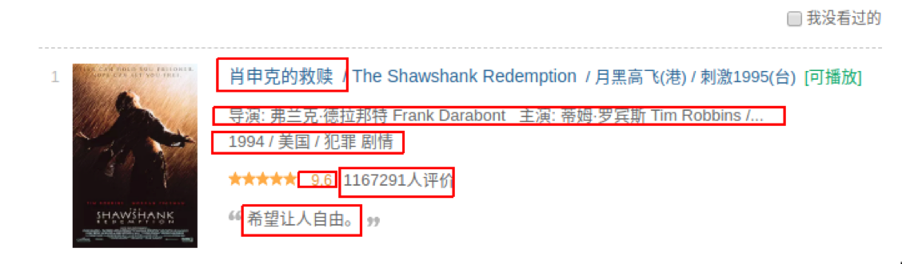

#Python数据采集与存储
##实验目的
###利用python的lxml,request,csv等模块采集与存储网页数据
##实验内容
###1、python采集豆瓣电影前250名信息

###2、将采集的信息存储在csv文件中
##实验步骤和结果
###[爬虫原理]
1.网络连接:计算机一次request请求和服务器的response回应,即实现了网络连接.

2.爬虫原理:在实现网络连接的过程中,爬虫做了两件事,

(1)模拟计算机对服务器发起request请求;

(2)接收服务器的response内容并解析,提取所需的信息.

###[爬虫思路分析]

1.爬取的内容为豆瓣电影TOP250的信息,如图所示
​​
​
2.爬取豆瓣电影TOP250信息,通过手动浏览,以下为前4页的网址:
https://movie.douban.com/top250?start=0&filter=
https://movie.douban.com/top250?start=25&filter=
https://movie.douban.com/top250?start=50&filter=
https://movie.douban.com/top250?start=75&filter=
发现,只需要改动start后面的数字就可以构造出10页的网址.

3.需要爬取的信息有:电影名称,导演及主演,电影信息,星级,评价数量,如图所示:
​​​​

4.运用Python中的csv库,把爬取的信息保存在本地

###[实验前准备工作]
1.确保安装爬虫需要的库,包括lxml,requests
如果没有安装,只需要执行如下命令即可安装:
	
	pip install lxml
	pip install requests
lxml库是基于libxml2的XML解析库的Python封装,用C语言编写,该库使用Xpath语法解析定位网页数据
request库用于向网页服务器发送请求,从而获得网页的数据

[实验代码]

```
from lxml import etree
import requests
import csv
​
fp = open('/home/jerry/文档/doubanfilm.csv','wt',newline='',encoding='utf-8') #create csv file
writer = csv.writer(fp)
writer.writerow(('name','actor','infomation','date','star','evaluate','introduction'))
urls = ['https://movie.douban.com/top250?start={}&filter='.format(str(i)) for i in range(0,250,25)]
headers = {
    'User-Agent':'Mozilla/5.0 (X11; Linux x86_64) AppleWebKit/537.36 (KHTML, like Gecko) Ubuntu Chromium/69.0.3497.81 Chrome/69.0.3497.81 Safari/537.36'
}  #act as browser
​
for url in urls:
    html = requests.get(url,headers=headers)
    selector = etree.HTML(html.text)   #catch html text
    infos = selector.xpath("//ol[@class='grid_view']/li")
    #visit all the urls and get infomation
    for info in infos:
        name = info.xpath(".//div[@class='item']//div[@class='info']//div[@class='hd']//a/span[1]/text()")
        actor = info.xpath(".//div[@class='item']/div[@class='info']/div[@class='bd']/p[1]/text()[1]")
        infomation = info.xpath(".//div[@class='item']/div[@class='info']/div[@class='bd']/p[1]/text()[2]")
        star = info.xpath(".//div[@class='item']//div[@class='info']//div[@class='bd']//div[@class='star']//span[2]/text()")
        evaluate = info.xpath(".//div[@class='item']//div[@class='info']//div[@class='bd']//div[@class='star']//span[4]/text()")
​
        #translate list to str & delete useless str
        names = ''.join(name)
        actors = ''.join(actor).strip().replace("\n","").replace("\xa0","")
        infomations = ''.join(infomation).strip().replace("\n","").replace("\xa0","")
        stars = ''.join(star)
        evaluates = ''.join(evaluate)
        print(names,actors,infomations,stars,evaluates)
        #write into doubanbook.csv
        writer.writerow((names,actors,infomations,stars,evaluates))
fp.close()

```
[实验结果]

```
肖申克的救赎 导演: 弗兰克·德拉邦特 Frank Darabont主演: 蒂姆·罗宾斯 Tim Robbins /... 1994/美国/犯罪 剧情 9.6 1167291人评价
霸王别姬 导演: 陈凯歌 Kaige Chen主演: 张国荣 Leslie Cheung / 张丰毅 Fengyi Zha... 1993/中国大陆 香港/剧情 爱情 同性 9.6 853722人评价
这个杀手不太冷 导演: 吕克·贝松 Luc Besson主演: 让·雷诺 Jean Reno / 娜塔莉·波特曼 ... 1994/法国/剧情 动作 犯罪 9.4 1076861人评价
阿甘正传 导演: Robert Zemeckis主演: Tom Hanks / Robin Wright Penn / Gary Sinise 1994/美国/剧情 爱情 9.4 921010人评价
美丽人生 导演: 罗伯托·贝尼尼 Roberto Benigni主演: 罗伯托·贝尼尼 Roberto Beni... 1997/意大利/剧情 喜剧 爱情 战争 9.5 537624人评价
泰坦尼克号 导演: 詹姆斯·卡梅隆 James Cameron主演: 莱昂纳多·迪卡普里奥 Leonardo... 1997/美国/剧情 爱情 灾难 9.3 856888人评价
千与千寻 导演: 宫崎骏 Hayao Miyazaki主演: 柊瑠美 Rumi Hîragi / 入野自由 Miy... 2001/日本/剧情 动画 奇幻 9.3 852939人评价
```
##[课外拓展-自选]
1.在上面代码基础上尝试将爬取数据保存到数据库当中;
参考资料:
		
	https://blog.csdn.net/ningyingqi/article/details/78762002

2.尝试用scrapy框架爬取当当网计算机类书籍信息,并保存到数据库当中.
参考链接(scrapy中文文档):

	http://www.scrapyd.cn/doc/179.html

