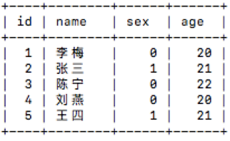
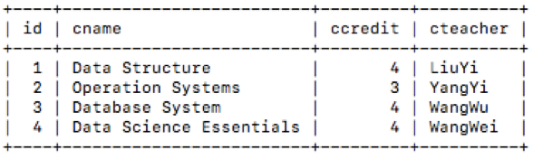
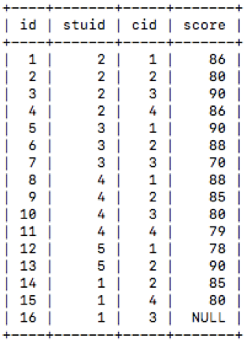
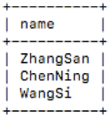
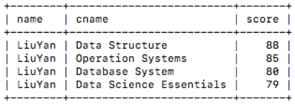
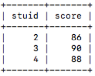
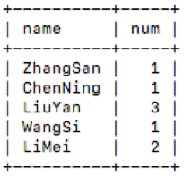
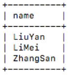
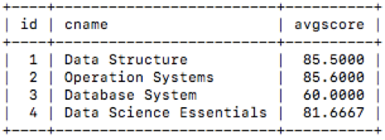

# 实验六 数据库操作

## 实验目的

通过SQL语句实践对Mysql数据库的操作

## 实验内容

根据题目要求，编写sql语句对student，course，grade三张表执行操作，获得结果。表结构如下：
	
•student表：

​
​​
​
​

•course表：

​​​
​​​​
•grade表：

​​​

### [前置操作]

启动数据库：
	
	sh /start-mysql.sh

登陆数据库：

	mysql -u root -p

#### 密码：123456

切换数据库：
	
	use test
## 实验步骤和结果

### 实验一 

[实验内容]
查询年龄大于20的所有学生，仅输出学生姓名。
[结果]

​​​

[参考答案]
	
	select name from student where age>20;

### 实验二

[实验内容]
查询LiuYan同学的各科成绩，输出name, cname, score。
[结果]

​​​​
​​​​

[参考答案]

	select name,cname,score
	from student st join grade g on st.id=g.stuid join course cs on 	cs.id=g.cid
	where name='LiuYan';

### 实验三

[实验内容]
查询课程'Data Structure'成绩>=80, <=90的学生，输出学生id（stuid）和成绩（score）。
[结果]

​​​
​​​​
​​​​
​​​​
​​​​
[参考答案]

	select stuid,score
	from grade g join course cs on cs.id=g.cid
	where cname='Data Structure' and score between 80 and 90;

### 实验四

[实验内容]
统计每个同学成绩为（70<= score <=85）的课程数，输出学生名字（name），课程数（num）。

​ 
​
​
​​ [参考答案]
​​ 

	select name,count(cid) num
	from student st join grade g on st.id=g.stuid join course cs on 	cs.id=g.cid
	where score between 70 and 85
	group by name;

### 实验五

[实验内容]
查询选修“Data Science Essentials”课程的学生，并按照成绩从低到高输出学生姓名（name）。
[结果]

​​​​
​​​​
​​​​
​​​​
​​​​

​​​
​​​​
[参考答案]

	select name
	from student st join grade g on st.id=g.stuid join course cs on 	cs.id=g.cid
	where cname='Data Science Essentials' 
	order by score;

### 实验六

[实验内容]
统计各个课程的平均分，输出课程id，cname，avgscore。注意：计算平均分时，grade表中的score为null的默认为0
提示：可使用ifnull将score为null的返回值设为0
[结果]

​​​
​​​​
​​​​
​​​​
[参考答案]

	select cs.id,cname,avg(ifnull(score,0)) as avgscore
	from course cs,grade g
	where cs.id=g.cid
	group by cs.id;

思考：order by 和 group by的使用有什么要注意的？在mysql中ifnull，isnull，nullif有什么区别？
​
​

​
​
## 课外拓展

•	使用show profile查看以上题目sql语句执行所用的时间。有些题目的答案不止一个，查看不同解答的sql语句执行用时，比较它们，思考为什么有些语句执行快，有些语句执行慢？慢在哪里？
参考链接：
	
	https://www.jianshu.com/p/7afcd5ba3708

