# 数据的全生命周期

## 实验目的

了解数据的全生命周期

了解基本的数据处理过程和数据可视化

## 实验背景

泰坦尼克号的沉没是历史上最臭名昭著的沉船事件之一。1912年4月15日，泰坦尼克号在处女航中撞上冰山后沉没，造成2224名乘客和机组人员1502人遇难。这一耸人听闻的悲剧震惊了国际社会，并导致了对船舶安全的监管。 

船只失事导致生命损失的原因之一是船上没有足够的救生艇供乘客和船员使用。尽管在沉船事件中幸存下来的一些因素，但有些人比其他人更容易生存，比如妇女、儿童和上层阶级。 这个问题提供了乘客的信息如姓名、年龄、性别、票价等相关信息和是否获救，然后需要建立一个模型，去预测另一批乘客是否能够获救。

通过这个实验，将体验完整的数据科学过程，包括：背景与研究目标、数据获取、数据预处理、探索性分析、数据建模和交流与展示。

我们需要根据数据集中每个乘客的个人信息，以及他们是否幸存的结果。在本节实验中，对应上述过程中的前三个部分，主要要求你完成数据的特征工程部分。

## 实验知识准备

特征工程主要包括特征提取和特征选择两部分。

特征提取：

​		1、探索性数据分析

​		2、数值特征处理（截断、二值化、分桶、缩放、缺失值处理、特征交叉、非线性编码、行统计量）

​		3、类别特征（自然数编码、独热编码等） 

​		4、时间特征 

​		5、空间特征 

​		6、文本特征 

特征选则：

​		1、过滤方法（覆盖率、皮尔逊相关系数） 

​		2、封装方法 

​		3、嵌入式方法

参考阅读材料：《美团机器学习实践》美团算法团队著，人民邮电出版社。第2章特征工程。

## 实验内容

- __目的__

对泰坦尼克号项目数据进行数据预处理，清洗，特征工程之后，得到从原始数据（图1）到可以直接导入到算法模型的数据（图2），从而用机器学习算法进行数据建模，预测遇难人员的生死。本节内容主要放在数据前期处理部分。


图-1: 算法模型数据

```
PassengerId: 乘客ID

Survived: 是否生存，0代表遇难，1代表还活着

Pclass: 船舱等级：1Upper，2Middle，3Lower

Name: 姓名

Sex: 性别

Age: 年龄

SibSp: 兄弟姐妹及配偶个数

Parch:父母或子女个数

Ticket: 乘客的船票号

Fare: 乘客的船票价

Cabin: 乘客所在的仓位（位置）

Embarked:乘客登船口岸 
```


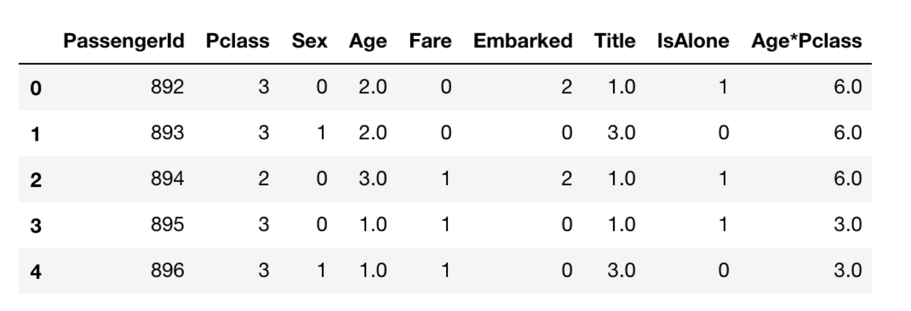

图-2:

- __过程__

导入实验需要涉及的相关库numpy,pandas。然后将实验涉及到的两份scv文件加载进来。

```Python
from numpy import *

import pandas as pd

train_df = pd.read_csv('./data/train.csv')

test_df = pd.read_csv('./data/test.csv')

Y_test = pd.read_csv('./data/gender_submission.csv')

combine = [train_df, test_df]
```

注意：文件的路径需要重新指定为自己本地文件存储的路径。combine表示将train_df,test_df合并成一个列表。

首先查看文件的基本信息

'''获取数据集头部信息'''

train_df.head(5)  #预览数据集前5行

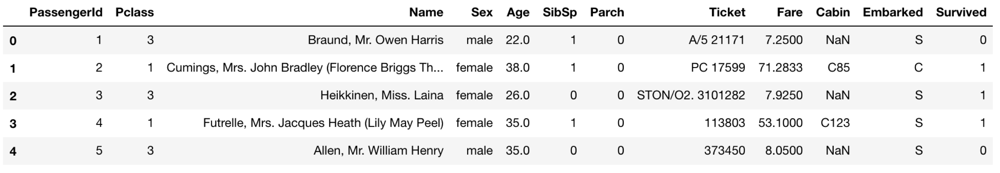

train_df.tail()  #预览数据集最后5行

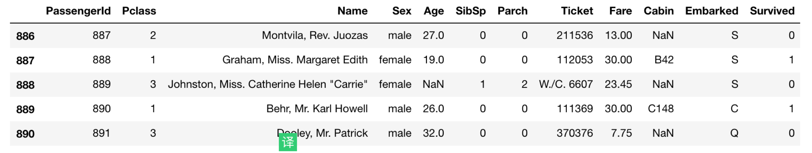

'''随机抽取样本'''

train_df.sample(5)   #随机预览指定参数的样本数据


随机从数据集中抽取样本，数量可以自由指定

'''文件总体描述'''

train_df.info()   #输出字段总共条数以及类型,dtype,memory空间

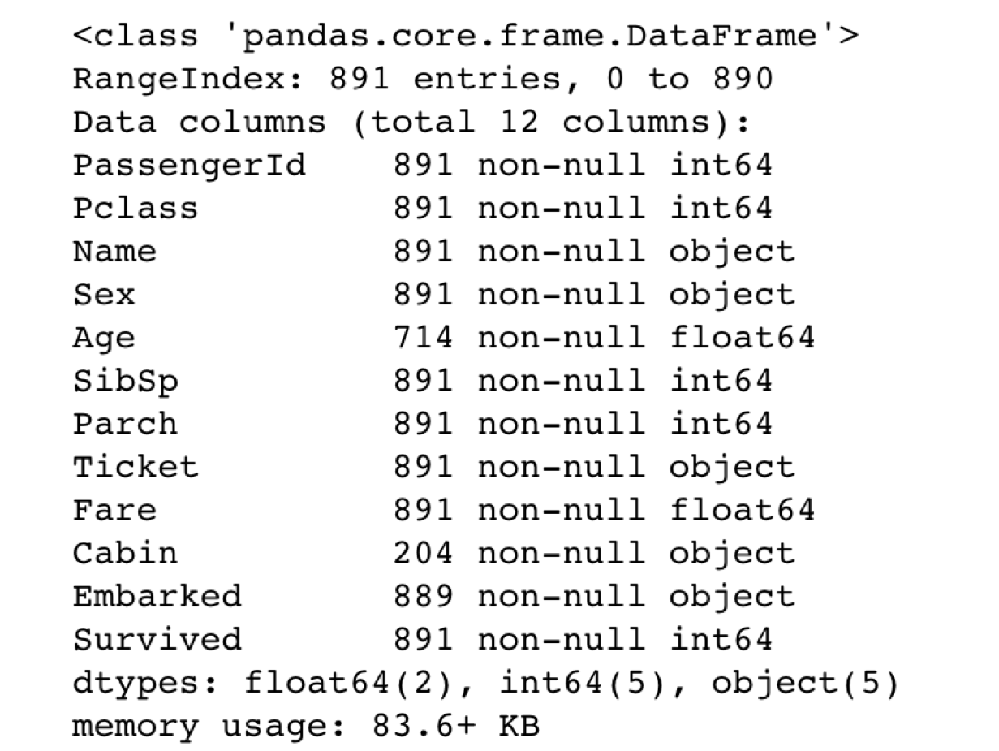

文件的总体描述信息，包括列名，行数，是否为空，类型和大小等信息。

'''探索性数据分析，定量技术，求样本方差，均值等来描述数据'''

train_df.describe()  #数据的描述（总数，平均值，std,最大\小值25%，50%，75%）对于数据的快速统计汇总

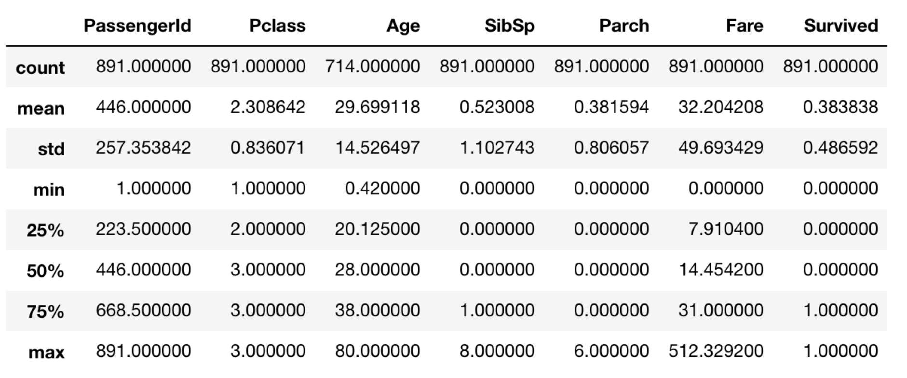

然后分析特征值和结果之间的关系

'''单变量过滤（覆盖率过滤方法）：特征变量和目标变量之间的相关性分析'''

```python
train_df[['Pclass','Survived']].groupby(['Pclass'],as_index=False).mean().sort_values(by='Survived',ascending=False)
```

\#按照某一类别计算生存的平均值,来观察该字段对结果的影响性大小

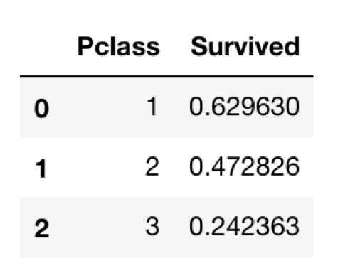

'''可视化数据'''

```python
import seaborn as sns

import matplotlib.pyplot as plt

%matplotlib inline

"""需要专门去了解seaborn和matplotlib的可视化机制"""

'''探索性数据分析（EDA），强调可视化数据，一类是可视化技术，一类是定量技术'''

g = sns.FacetGrid(train_df, col='Pclass')

g.map(plt.hist, 'Age', bins = 20)  #建立数据集中两个子集之间的对应关系
```

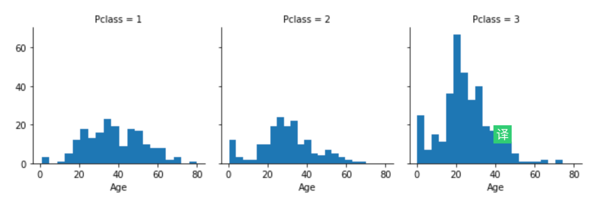

```python
grid = sns.FacetGrid(train_df, row='Embarked', size=2.2, aspect=1.6)

grid.map(sns.pointplot, 'Pclass', 'Survived', 'Sex', palette='deep')

grid.add_legend()
```

#### 探索Embarked和survived之间的影响关系

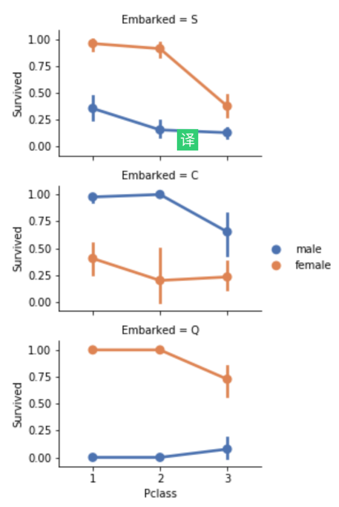


'''文本特征处理：文本统计特征'''

```
for dataset in combine:

​    dataset['Title'] = dataset.Name.str.extract('([A-Za-z]+)\.',expand=False)

pd.crosstab(train_df['Title'], train_df['Sex'])  #找出每个name缩写的人数
```


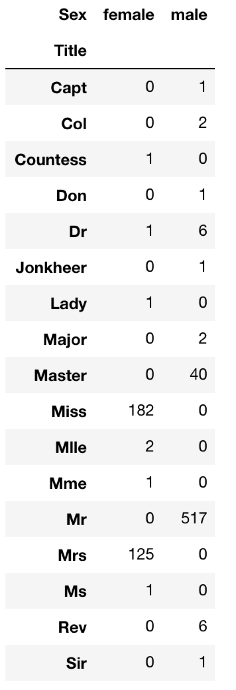

```python
'''文本特征，类似于特征的融合'''

for dataset in combine:  #替换和融合原来特征,并且生成新的特征,然后按照某一特征进行分类

​    dataset['Title'] = dataset['Title'].replace(['Lady', 'Countess','Capt', 'Col','Don', 'Dr', 'Major', 'Rev', 'Sir', 'Jonkheer', 'Dona'], 'Rare')

​    dataset['Title'] = dataset['Title'].replace('Mlle', 'Miss')

​    dataset['Title'] = dataset['Title'].replace('Ms', 'Miss')

​    dataset['Title'] = dataset['Title'].replace('Mme', 'Mrs')

train_df[['Title', 'Survived']].groupby(['Title'], as_index=False).mean()


```

将原始数据中稀少的数据统一用rare替换

'''类别特征：自然数编码，此外比较常用的还有one-hot编码'''

```python
title_mapping = {'Mr':1, 'Miss':2, 'Mrs':3, 'Rare':4}

for dataset in  combine:

​    dataset['Title'] = dataset['Title'].map(title_mapping)

​    dataset['Title'] = dataset['Title'].fillna(0)

train_df.head()  #将非数值型特征转换为数值型特征


```




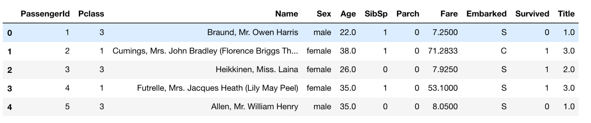

将Mr变换为1，Miss变换为2，Mrs变换为3，Rare变换为4。并将所有是缺失值的用0填充。

```python
train_df = train_df.drop(['Ticket'], axis=1)

test_df = test_df.drop(['Name'], axis=1)

combine = [train_df, test_df]

 \#删除掉已经融合过得特征



'''自然数编码'''

for dataset in combine:

​    dataset['Sex'] = dataset['Sex'].map({'female':1, 'male':0}).astype(int)

train_df.head()  #利用map函数直接将非数值型数值转换为数值型数据
```


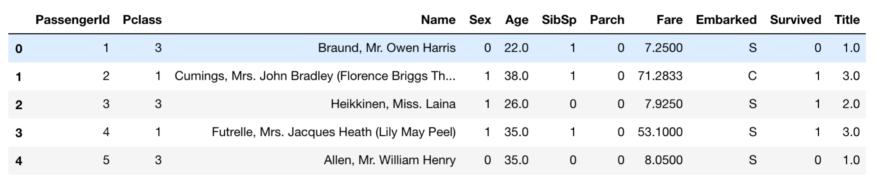

将所有数据的性别信息用自然数1，2进行编码

```python
'''数值特征处理：分桶'''

train_df['AgeBand'] = pd.cut(train_df['Age'], 5) #将年龄均分成5个年龄段

'''过滤方法：覆盖率'''

train_df[['AgeBand', 'Survived']].groupby(['AgeBand'], as_index=False).mean().sort_values(by='AgeBand', ascending=True)

#计算各个年龄段的存活率,按照年龄段升序排序

train_df[['Pclass', 'Survived']].groupby(['Pclass'], as_index=False).mean().sort_values(by='Survived', ascending=True)

#用序号来代替每个年龄段

'''数值处理分桶——>自然数编码'''

for dataset in combine:    

​    dataset.loc[ dataset['Age'] <= 16, 'Age'] = 0

​    dataset.loc[(dataset['Age'] > 16) & (dataset['Age'] <= 32), 'Age'] = 1

​    dataset.loc[(dataset['Age'] > 32) & (dataset['Age'] <= 48), 'Age'] = 2

​    dataset.loc[(dataset['Age'] > 48) & (dataset['Age'] <= 64), 'Age'] = 3

​    dataset.loc[ dataset['Age'] > 64, 'Age']

train_df.head()
```

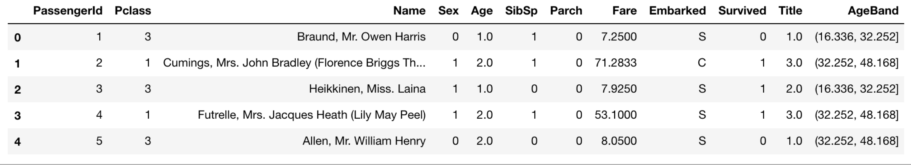

```python


 #删除掉AgeBend特征

train_df = train_df.drop(['AgeBand'], axis=1)

'''数值处理：特征交叉'''
#组合现有的特征,融合成新的特征

for dataset in combine:

​    dataset['FamilySize'] = dataset['SibSp'] + dataset['Parch'] + 1  #将SlibSp,Parch合成一列

train_df[['Survived', 'FamilySize']].groupby(['FamilySize'], as_index=False).mean().sort_values(by='Survived', ascending=False)
```


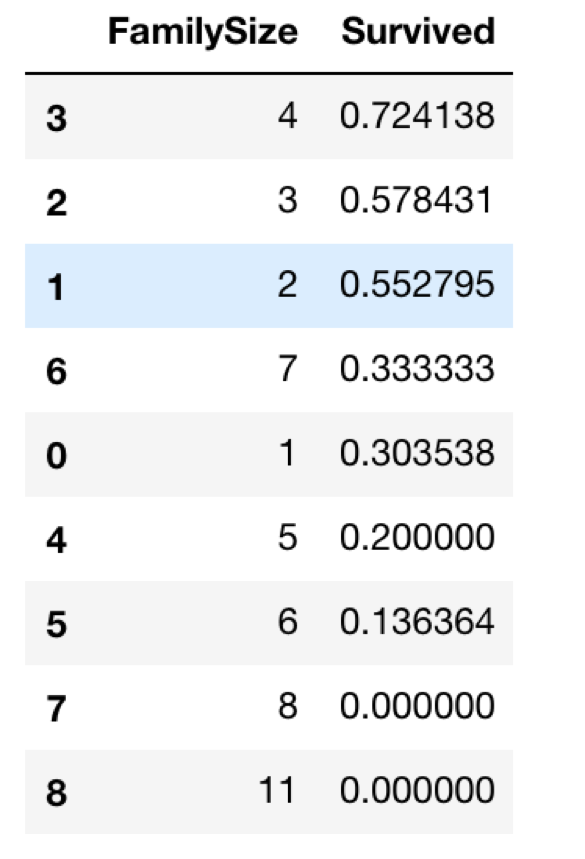

```python
'''数值处理：缩放'''

\#融合新的特征 是否独自乘船

for dataset in combine:

​    dataset['IsAlone'] = 0

​    dataset.loc[dataset['FamilySize'] ==1, 'IsAlone'] = 1

train_df[['IsAlone', 'Survived']].groupby(['IsAlone'], as_index = False).mean()
```


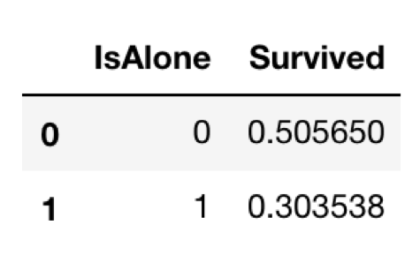

```python
# 将SibSp,Parch和FamilySize融合成一列IsAlone

train_df = train_df.drop(['SibSp', 'Parch', 'FamilySize'], axis=1)

test_df = test_df.drop(['SibSp', 'Parch', 'FamilySize'], axis=1)

combine = [train_df, test_df]

train_df.head(6)
```


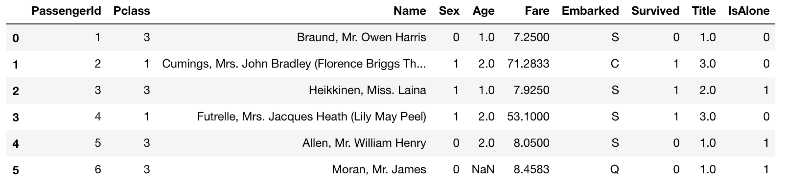

```python
'''数值处理：特征交叉'''

\#直接对现有特征进行加减乘除生成新的特征

for dataset in combine:

​    dataset['Age'] = dataset['Age'].fillna(0)

​    dataset['Age*Pclass'] = dataset.Age * dataset.Pclass

train_df.loc[:,['Age*Pclass', 'Age', 'Pclass']].head(10)
```


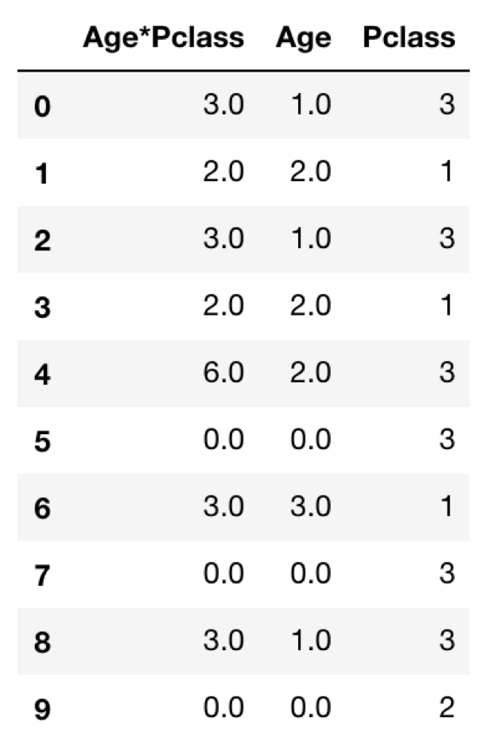

```python


'''数值处理：缺失值处理，用频率最高的替代缺失值'''

freq_port = train_df.Embarked.dropna().mode()[0]  #计算Embarked特征最高频率值

for dataset in combine:

​    dataset['Embarked'] = dataset['Embarked'].fillna(freq_port)  #用最高频率值替代缺失值

train_df[['Embarked', 'Survived']].groupby(['Embarked'], as_index=False).mean().sort_values(by='Survived', ascending=False)
```

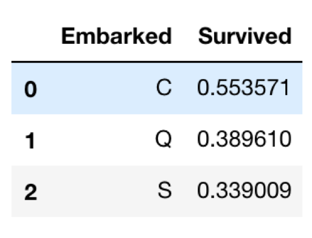

```python
'''类别特征：自然编码'''

\#把分类要素转换为数字

for dataset in combine:

​    dataset['Embarked'] = dataset['Embarked'].map({'S':0, 'C':1, 'Q':2}).astype(int)

train_df.head()
```


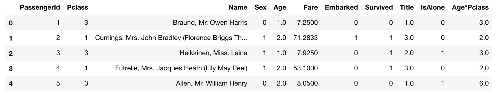

```python
test_df['Fare'].fillna(test_df['Fare'].dropna().median(), inplace=True)

'''数值处理：分桶—->自然编码（one-hot编码）'''

train_df['FareBand'] = pd.qcut(train_df['Fare'], 4)

train_df[['FareBand', 'Survived']].groupby(['FareBand'], as_index=False).mean().sort_values(by='FareBand', ascending=True)
```

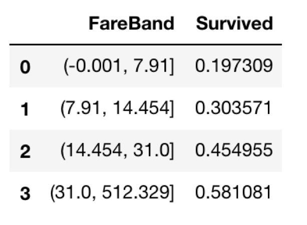

```python
# 将Fare按区间分成四段之后映射成4个数字

for dataset in combine:

​    dataset.loc[ dataset['Fare'] <= 7.91, 'Fare'] = 0

​    dataset.loc[(dataset['Fare'] > 7.91) & (dataset['Fare'] <= 14.454), 'Fare'] = 1

​    dataset.loc[(dataset['Fare'] > 14.454) & (dataset['Fare'] <= 31), 'Fare']   = 2

​    dataset.loc[ dataset['Fare'] > 31, 'Fare'] = 3

​    dataset['Fare'] = dataset['Fare'].astype(int)


train_df = train_df.drop(['FareBand'], axis=1)

combine = [train_df, test_df]

​    

train_df.head(10)
```


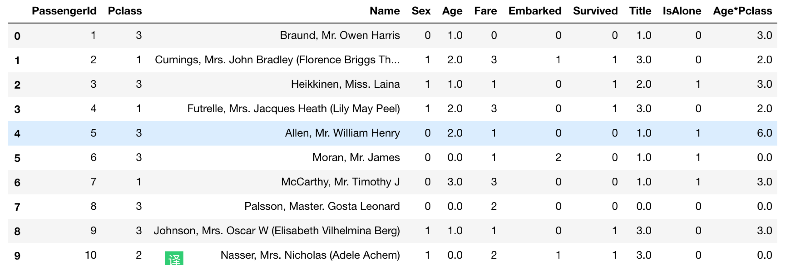

```python
test_df = test_df.drop('Survived', axis=1)
train_df.head()
```

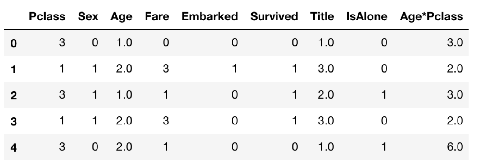

至此，恭喜你已经学会了对于数据初步的特征工程处理，可以将数据直接导入到机器学习的相关模型中进行训练，怎么样用模型训练数据会在下一节课介绍。

 