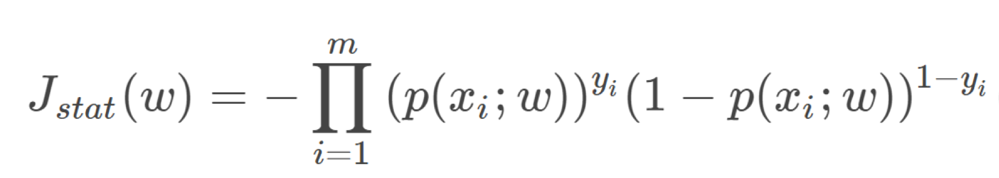
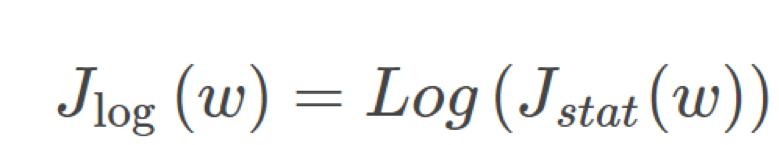
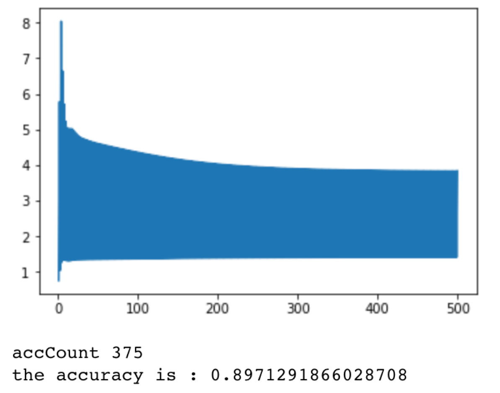

# 实验九 建模与分析

## 实验目的

1、了解数据的全生命周期

2、在对数据进行预处理之后能够利用相关机器学习算法进行建模，对数据集进行分析和预测。

## 实验背景

在继实训8做完泰坦尼克号项目的数据预处理部分之后，得到了清洗干净并做好特征工程的数据集，接下来要对数据集进行建模，分析预测遇难人员是生存还是死亡。

## 实验知识准备

逻辑回归基础知识可以参考如下博客，实验课上我们会做详细的理论和代码讲解。

https://blog.csdn.net/han_xiaoyang/article/details/49123419

本次实验内容为数据分析和建模阶段，使用的数据为上次实验处理好的数据集。

简单来说，我们的建模过程分为下面两个阶段：

1、设计合适的损失函数，在这里我们基于最大似然函数来设计我们的损失函数。简单解释一下（假设你已经大致看过上面的博客并对逻辑回归有了简单的认识），我们将我们的计算结果通过sigmod转化到[0,1]的区间，可以理解为所属类别的概率。那么对于我们的m个样本点，我们希望我们的模型能够使得所有样本点的预测结果属于真实类别的概率最大，所以通过最大似然估计得到公式如下。






2、使用优化算法来求解能最大化log-likelihood函数的w参数值。如梯度下降（上升）算法和牛顿法，这里我们使用梯度算法。我们需要记住的是，我们的log-likelihood函数是参数w的函数，我们通过不断迭代计算调整参数的取值来更新我们的参数（模型）。下面的链接是对梯度下降（上升）算法的介绍。

https://blog.csdn.net/u013709270/article/details/78667531

## 实验内容

实验数据下载地址：https://github.com/JerryKuan/data

数据说明：本次实验数据是上节课完成特征工程后的数据，为方便本次实验特意统一提供处理好的数据，若上节课数据已经完全处理完，也可使用自己的数据。其中，```train_x.csv```表示训练集的特征,```test_y.csv```表示测试集的特征，```train_y.csv```表示训练集的标签（遇难人员是生是死），```gender_submission_init.csv```表示测试集的标签

```python
import numpy as np

from numpy import *

import pandas as pd

import csv

import matplotlib.pyplot as plt


"""

定义sigmoid函数，将结果映射到[0,1]区间

"""

def sigmoid(inX):

​    return 1.0/(1+exp(-inX))

""" 

classify用于计算样本点所属类别

"""

def classify(inX,weights):

​    prediction = sigmoid(sum(inX * weights))

​    #print ("prediction",prediction)

​    if prediction>0.5:

​        return 1

​    else:

​        return 0

​    

def load_data():

​    """

​    读入数据集

​    """ 

​    train_x = pd.read_csv('./data/train_x.csv')

​    test_x = pd.read_csv('./data/test_x.csv')

​    test_y = pd.read_csv('./data/gender_submission_init.csv')

​    train_y = pd.read_csv('./data/train_y.csv')

​    return [train_x.values,train_y.values[:,1],test_x.values,test_y.values[:,1]]

   


def error_function(X,theta,Y):

​    """

​        计算损失函数

​    """

​    

​    diff = X*theta -Y.T

​    #print ('diff',diff.shape)

​    t = diff.T*diff

   

​    return t/(2*len(X))


def gradAscent(dataMat,labelMat,alpha=0.001,maxCycles=500):

​    """

​    使用梯度上升算法，通过不断迭代改变参数的值来优化目标函数

​    """

​    m,n=shape(dataMat)

​    weights=np.ones((n,1))

​    errors=[]

​    #循环迭代次数

​    for k in range(maxCycles):

​        #求当前的sigmoid函数预测概率

​        h=sigmoid(dataMat*weights)

​        #***********************************************

​        #此处计算真实类别和预测类别的差值

​        #对logistic回归函数的对数释然函数的参数项求偏导

​        error=(labelMat.T-h)

​        #更新权值参数                                                     

​        weights=weights+alpha*dataMat.transpose()*error

​        #***********************************************

​        err = error_function(dataMat,weights,labelMat)

​        #print("err",err)

​        errors.append(float(err))

​    return weights,errors


def test_acc(test_x,test_y,weights):

​    """

​        计算测试的内容

​    """

​    accCount = 0  #统计分类准确的个数

​    numTest = len(test_x) #统计纳入分类统计的总数

​    result = []

​    for i in range(len(test_x)):  

​        h = classify(test_x[i,:],weights)

​        result.append(h)

​        if h == test_y[0][i]:  #判断加载的每一个数据分类是否准确

​            accCount = accCount + 1

​    print ("accCount",accCount)

​    accuracy = (float(accCount) / numTest)

​    print('the accuracy is : %s' % accuracy) 

​    return result


'''将预测结果写入到csv文件中'''

def storeResult():

​    result = test_acc(test_x,test_y,trainWeights)


​    

​    dataframe = pd.DataFrame(result)

​    dataframe.to_csv('./data/Result.csv', sep=',')

​    

​    


train_x,train_y,test_x,test_y = load_data()

train_y = train_y[np.newaxis,:]

test_y = test_y[np.newaxis,:]

trainWeights,errors = gradAscent(np.mat(train_x),np.mat(train_y))

l = [i for i in range(1,len(errors)+1)]


plt.plot(l,errors)

plt.show()

# print (trainWeights)

# test_acc(test_x,test_y,trainWeights)

storeResult()
```

__实验结果__



## 课后作业

数据探索:对已经学习过的数据探索的方法,对数据集Iris(下载地址:https://github.com/JerryKuan/data,也可以直接通过sklearn库调用数据集)进行数据探索,完成以下任务,所有题目均为可视化表或者图输出.

1.使用describe()描述数据集统计信息

2.使用info()描述数据集整体信息

3.使用seaborn的FaceGrid()描述sepal length和类别之间的关系

4.使用pyplot描述sepal length和sepal width,petal length和petal width之间的联系

5.使用seaborn的FaceGrid(),用不同颜色的点来表示数据所属的类别

6.使用seaborn的boxplot()通过箱线图查看单个特征的分布

7.使用seaborn的boxplot()和stripplot(),在箱线图基础上添加散点图,jitter设置成True使散点图分开,不然会连成一条线

8.使用seaborn的FaceGrid()绘出核密度图（单个变量）

9.使用seaborn的pairplot()描述任意两个变量之间的关系

参考答案:https://github.com/JerryKuan/data

 